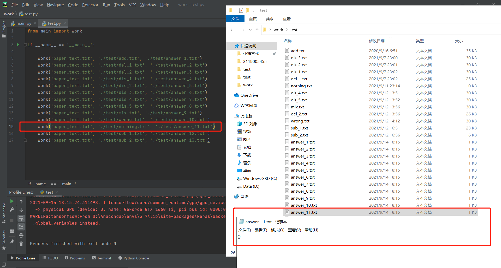

### 0.作业声明

| 这个作业属于哪个课程 | [信安1912-软件工程 (广东工业大学 - 计算机学院)](https://edu.cnblogs.com/campus/gdgy/InformationSecurity1912-Softwareengineering/) |
| -------------------- | ------------------------------------------------------------ |
| 这个作业要求在哪里   | [个人项目作业](https://edu.cnblogs.com/campus/gdgy/InformationSecurity1912-Softwareengineering/homework/12146) |
| 这个作业的目标       | [论文查重](https://github.com/bitter465/3119005455/tree/main/work_1) |

### 1.作业github链接

[作业github链接](https://github.com/bitter465/3119005455/tree/main/work_1)

### 2.PSP表格

| PSP2.1                                | Personal Software Process Stages       | 预计耗时（分钟） | 实际耗时（分钟） |
| ------------------------------------- | -------------------------------------- | ---------------- | ---------------- |
| Planning                              | 计划                                   | 15               | 5                |
| Estimate                              | 估计这个任务需要多少时间               | 15               | 5                |
| Development                           | 开发                                   | 300              | 330              |
| Analysis                              | 需求分析（包括学习新技术）             | 15               | 10               |
| Design Spec                           | 生成设计文档                           | 30               | 45               |
| Design Review                         | 设计复审                               | 15               | 30               |
| Coding Standard                       | 代码规范（为目前的开发制定合适的规范） | 30               | 45               |
| Design                                | 具体设计                               | 30               | 45               |
| Coding                                | 具体编码                               | 300              | 330              |
| Code Review                           | 代码复审                               | 30               | 15               |
| Test                                  | 测试（自我测试，修改代码，提交修改）   | 60               | 25               |
| Reporting                             | 报告                                   | 30               | 45               |
| Test Reporting                        | 测试报告                               | 30               | 10               |
| Size Measurement                      | 计算工作量                             | 15               | 5                |
| Postmortem & Process Improvement Plan | 事后总结，并提出过程改进计划           | 15               | 25               |
|                                       | 合计                                   | 930              | 970              |

### 3.计算模块接口的设计与实现过程

0.设计前提

由于大二学年跟随部分研究生师兄姐以及导师学习，所以学习内容与大部分同学不同，本人主要学习内容为深度学习（deep learning）中的自然语言处理（natural language processing），此次作业目标为论文查重，涉及到的自然语言处理任务为文本匹配，可用模型有dssm、cdssm、arc-ii、mvlstm、match_pyramid、drcn、esim

1.模型简介

dssm模型是早期为了解决文本匹配问题而被提出，其工作原理较为简单，但其确实文本匹配领域的开山之作，后期诞生的模型大多都以dssm模型为base model改进，这里简要描述一下dssm模型的工作原理：由于单词或字符是可以不断创造的，容易产生OOV（单词不在词库的范围内）的情况，于是先将传进来的输入经过一个word hashing，而word hashing实际上是一个tri-gram的操作，例如单词boy，转化为“#bo”、“boy”、“oy#”，这样便可极大程度的消除OOV情况，从而也将维度从50w降到3w；然后经过三层全连接层，对输入进行语义特征的提取；最终得到输入的语义向量，根据对两个输入的语义向量求取余弦相似度，即等同于文本相似度

随着时代的推移，卷积神经网络诞生了，根据后世经验，CNN在提取语义特征的功能绝对是优于全连接层，于是微软公司针对DSSM在网络架构方面的局限性，于2014年提出cssm模型的变种cdssm模型。程序中最终选择效法的模型为cdssm模型，模型所涵盖的知识点为词向量（Word2Vec）、卷积神经网络（CNN）、池化（pooling）、多层感知机（MLP）、Dropout，模型相较于dssm模型最大差别就在于使用CNN代替了全连接层用来提取语义特征

2.代码组成

a.数据预处理函数pad_sequences

函数pad_sequences可对输入的数据进行padding操作，比如如果输入的数据短于程序设定的长度，剩余不足长度的序列将用[pad]来填充，这个操作推进了后期注意力机制中mask操作的出现；而如果输入的数据长于程序设定的长度，超长的部分将被截断，本程序设定最大长度前使用Notepad++查看过各文件的长度，均在35000个字符以下，于是设定最大长度为35000

b.模型定义函数bitter

模型定义函数bitter构建模型的网络结构，定义一个embedding层，接着定义一个一维卷积层，一维卷积层的卷积核大小设置为3；为了节省部分不必要的时间，通过一个dropout层丢弃部分信息，后对信息序列分别进行全局最大池化，经过一层全连接层双曲正切，送入多层感知机降维，最后输出层使用softmax进行2分类任务，即是否为同义文

c.工作函数work

工作函数work先为程序设定了模型的参数，后获取程序启动时输入的文件名，并获取对应文件的内容，比如"python main.py paper_text.txt paper_add.txt,similarity_number_1.txt"，程序就可读取指定的论文原文，增操作后的抄袭论文，保存重复率的文件路径；获取文本内容后，制作词库，做一个word to index字典，让每一个字符对应一个下标，词库和字典供模型的embedding层将论文内容转化为下标序列；调用模型定义函数，建立模型，编译模型，然后预测相似度

f.主函数main

调用工作函数work

3.程序流程图

4.算法关键及特殊点

算法的关键在于word hashing结构的存在，程序为了避免OOV的情况，采用了word hashing的操作，比如单词"boy"就会被tri-gram分为"#bo"、"boy"、"oy#"，单词是可造可无限的，但是组成单词的字符必是有限的，所以使用word hashing可以避免OOV的情况；同样padding的存在也是必要的，padding使用[pad]补缺两篇论文字数差，使得两篇论文哪怕字数不一样也可以进行比较

### 4.计算模块接口部分的性能改进

1.从繁到简的突破

参照作业要求中的限制，原先编程完毕的程序不符合作业要求（5秒内给出答案，不能读写其他任何文件），此处简介一下原程序：内含前文列举的cdssm、arc-ii、mvlstm、match_pyramid、drcn、esim六种模型，均可以运行，且该六种模型均有经过训练，保存了最优权重，训练数据采用蚂蚁金融2019年的NLP比赛数据，其中mvlstm、drcn、esim三种模型的训练时间均在2h以上，并且在计算论文相似度的时候，六种模型均需要较长时间的预处理操作和加载预训练权重以及预测操作，无法在5秒内给出答案，且占用大量显存，其中受限于我本身的显卡条件，esim模型甚至无法高精度运行，产生OOM的报错，以下展示原程序的相关信息：

修改后的新程序删去了arc-ii、mvlstm、match_pyramid、drcn、esim五种模型，仅保留了cdssm模型，其精度上对比原程序绝对是不如的，且删除了预训练操作，直接构建模型然后就投入使用，并将预处理操作一并放入一个.py文件内，极大地压缩了占用空间与计算时间，虽然原程序较大，但后续会尝试将原程序一同上传

2.性能分析工具（VS 2019）

3.程序中消耗最大的函数

此处从work函数逐层分析寻找消耗最大函数

### 5.计算模块部分单元测试展示

在test文件夹中存放了13个不同抄袭程度的论文供test.py使用"coverage run test.py"进行单元测试并记录代码覆盖率，使用"coverage report"读取前面保存的.coverage文件，输出覆盖率

### 6.计算模块部分异常处理说明

1.文件路径错误

正常的运行指令应类似于"python main.py paper_text.txt paper_add.txt similarity_number_1.txt"，但如果在输入参数的时候，输错了文件名，则报错FileNotFoundError，这个时候只要重新确认指令就可以了

2.空文件仍有相似度

在前文进行单元测试的时候，一个"nothing.txt"文件仍可以与原论文计算出0.50444204的相似度，这显然是不合理的，此时修改代码，在最后向答案文件输入相似度的时候，添加一个判断条件，具体如下：

### 7.总结

讲道理，这第一次作业难度还是存在一点的，涉及到的具体知识较为广泛，多为NLP领域知识，好在自身之前就在学习相关内容，这个程序跑出来的结果依次如下，做完这次作业自身的收获还是颇多的，反复修改代码，写bug改bug这个过程也是对自己耐心的一次锻炼

