### 0.作业声明

| 这个作业属于哪个课程 | [信安1912-软件工程 (广东工业大学 - 计算机学院)](https://edu.cnblogs.com/campus/gdgy/InformationSecurity1912-Softwareengineering/) |
| -------------------- | ------------------------------------------------------------ |
| 这个作业要求在哪里   | [结对项目](https://edu.cnblogs.com/campus/gdgy/InformationSecurity1912-Softwareengineering/homework/12147) |
| 这个作业的目标       | [四则运算生成/检查器](https://github.com/bitter465/3119005455/tree/main/work_2) |

### 1.作业github链接

[作业github链接](https://github.com/bitter465/3119005455/tree/main/work_2)

### 2.PSP表格

| PSP2.1                                | Personal Software Process Stages       | 预计耗时（分钟） | 实际耗时（分钟） |
| ------------------------------------- | -------------------------------------- | ---------------- | ---------------- |
| Planning                              | 计划                                   | 15               | 5                |
| Estimate                              | 估计这个任务需要多少时间               | 15               | 5                |
| Development                           | 开发                                   | 300              | 330              |
| Analysis                              | 需求分析（包括学习新技术）             | 15               | 10               |
| Design Spec                           | 生成设计文档                           | 30               | 45               |
| Design Review                         | 设计复审                               | 15               | 30               |
| Coding Standard                       | 代码规范（为目前的开发制定合适的规范） | 30               | 45               |
| Design                                | 具体设计                               | 30               | 45               |
| Coding                                | 具体编码                               | 300              | 330              |
| Code Review                           | 代码复审                               | 30               | 15               |
| Test                                  | 测试（自我测试，修改代码，提交修改）   | 60               | 25               |
| Reporting                             | 报告                                   | 30               | 45               |
| Test Reporting                        | 测试报告                               | 30               | 10               |
| Size Measurement                      | 计算工作量                             | 15               | 5                |
| Postmortem & Process Improvement Plan | 事后总结，并提出过程改进计划           | 15               | 25               |
|                                       | 合计                                   | 930              | 970              |

### 3.效能分析

1.从无到有的突破

参照作业要求中的限制，生成的表达式需要有括号对，需要不能重复，需要非负和真分数，既然无法使用波兰表达式和树实现，就直接在字符串层面下手，这样同样方便了计算有括号对的表达式，我们提出一个思路，由于括号对的优先级比其他运算符都高，写成波兰表达式和树，对代码编写能力其实是有比较高的要求，秉着原创不抄袭的想法，既然我们仅靠自己无法做出来，那就换一种实现方法，我们设想检查表达式中的括号对，先将括号对中的表达式片段进行计算，将计算结果与括号对外的表达式组成新的表达式，这个时候就可以同样调用计算函数calculate，而不用再另设一个tree的类

2.性能分析工具（VS 2019）

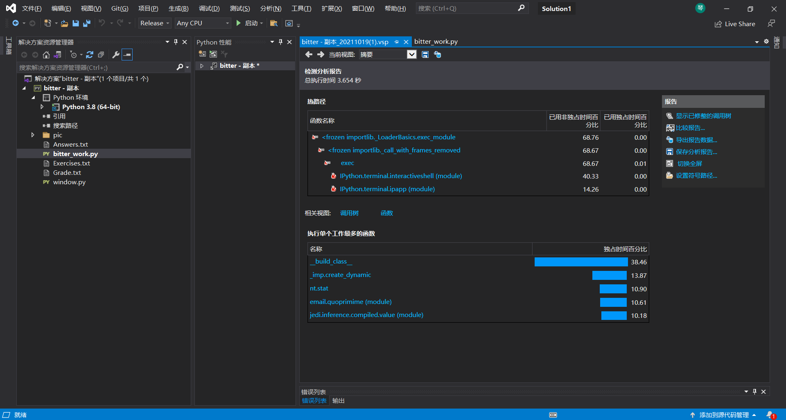

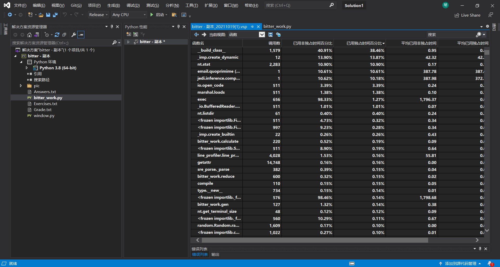

3.程序中消耗最大的函数

此处从gen_work函数逐层分析寻找消耗最大函数，最终得出gen_work->gen->calculate_all->calculate

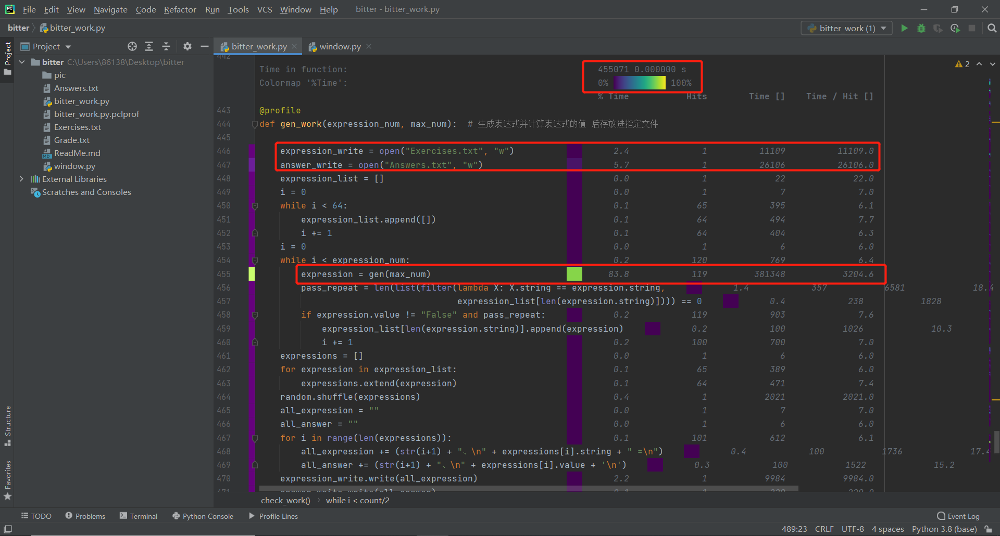

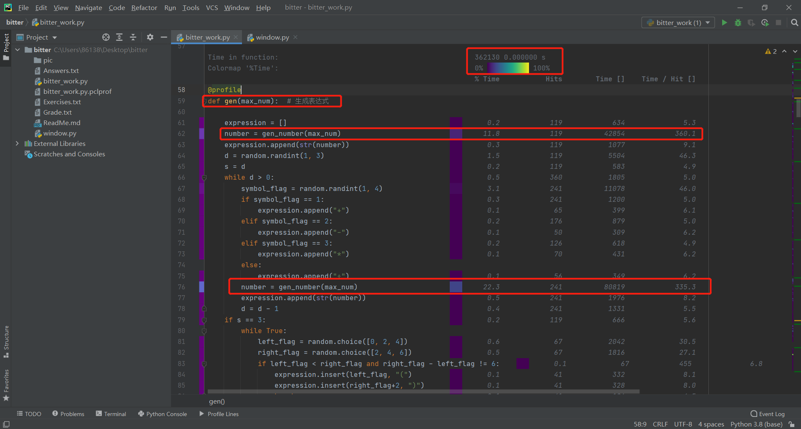

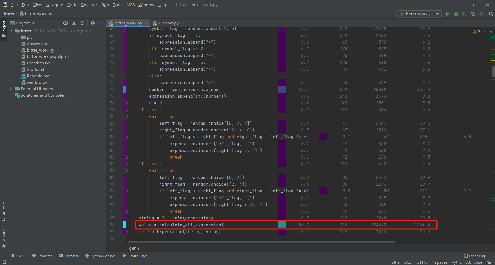

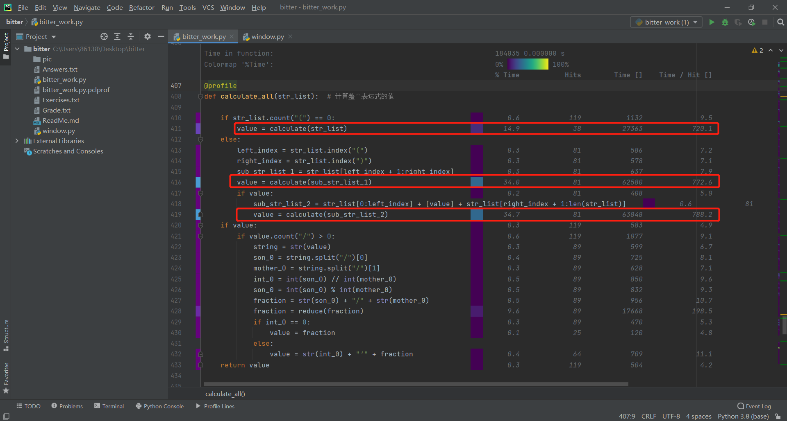

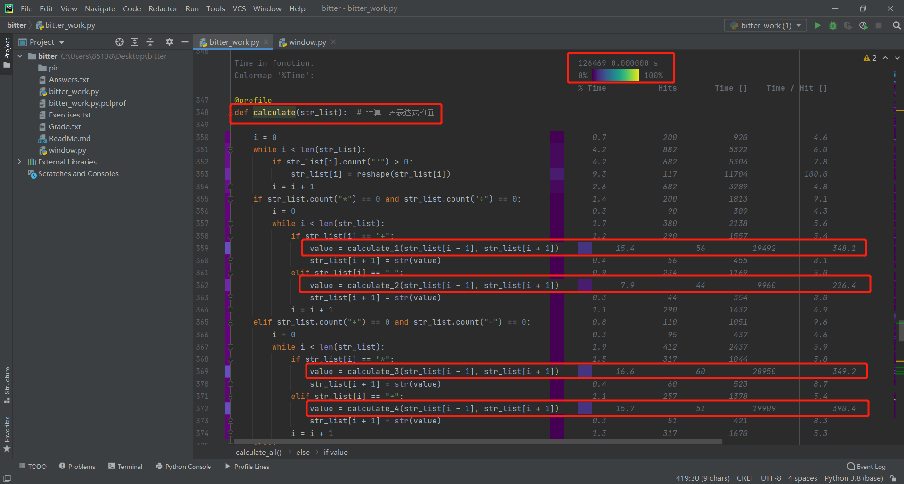

### 4.设计实现过程

0.设计前提

先来点真实的，讲道理，之前真的没写过这种作业，所以这次作业起步非常的困难，首先是要求还是比较多的，9点要求里面最折磨我们的首先是题目不能重复，其次是真分数，关于这个不能重复，占了整个程序编写最多的时间，真分数想到最后是结合近期密码学引论作业的辗转相除法求最大公因子，利用真因子去约分每一个分数，想想还是觉得比较有意思的，结合了两个课的内容

1.程序简介

看一下题目说明，既然要生成多种数据，那么就要去写多种数据生成函数，整数、分数、带分数分别各一个生成函数，然后随机生成符号，再随机嵌入括号对，生成最终的表达式，这里注意要去重，避免生成重复的表达式，最终送入计算函数，做完实现的程序，就可以加上图形界面了，程序分为两个文件组成，一个是函数文件bitter_work.py，一个是图形化界面驱动文件window.py

2.程序流程图

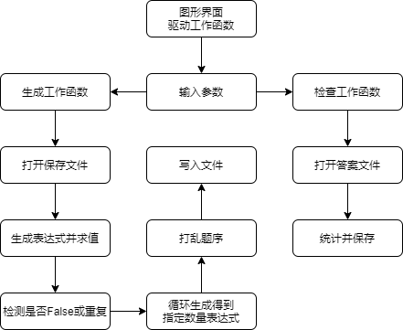

3.算法关键及特殊点

由于我们技术不足，没有做到使用波兰表达式和树，所以我们生成和计算表达式都是基于字符串，直接对表达式进行处理，但结果与是用波兰和树没有区别，在代码长度上也没有很大的差别

### 5.代码说明

注：为保证代码的清晰可见，注释写上去代码变得很冗长，所以这里将原本的注释写于代码上方文字

a.最大公因子计算函数gcd

使用辗转相除法，递归调用函数自身，求出传入的两个参数的最大公因子，提供给后面约分和通分调用

```python
def gcd(a, b):  # 使用辗转相除法计算两个数的最大公因子
    
    if a % b == 0:
        return b
    else:
        return gcd(b, a % b)
```

b.约分函数reduce

将传入的分数分出分子与分母，调用gcd函数，得到分子和分母的最大公因子，分子分母同除公因子，得到约分结果，如果此时分母为1，则约分结果为整数

```python
def reduce(string):  # 对一个分数进行约分

    a_b = string.split("/")
    a = int(a_b[0])
    b = int(a_b[1])
    max_factor = gcd(a, b)
    after_a = a // max_factor
    after_b = b // max_factor
    after_string = str(after_a) + "/" + str(after_b)
    if after_b == 1:
        after_string = str(after_a)
    return after_string
```

c.生成真分数函数gen_fraction

由于题目要求规定分母不能超过传入的最大值参数，所以这里生成分子和分母需要注意randint的范围，分母的范围是2到最大值减一，分子的范围是1到分母减一，得到一个分数，但此时不一定是真分数，所以需要调用约分函数，将分数转为真分数

```python
def gen_fraction(max_num):  # 生成一个真分数

    mother = random.randint(2, max_num-1)
    son = random.randint(1, mother-1)
    after_string = str(son) + "/" + str(mother)
    fraction = reduce(after_string)
    return fraction
```

d.生成数字函数gen_number

首先判断一下传入最大值是什么，由于题目要求传入最大值为1程序仍可以运行，所以这里需要给予一个特殊情况，当传入最大值为1时，由于只能生成分数，为确保题目的数量充足，所以将分母的取值范围更换为2到100，生成之后同样经过一次约分

其次，对于其他最大值，则可以正常生成数字，使用一个randint(0, 2)，如果是0，生成整数；如果是1，生成真分数；如果是2，生成带分数。由于题目规定整数同样不能超过最大值，所以整数的范围是1到最大值减一；对于带分数，其实就是一个整数接一个真分数，这里的整数范围依然是1到最大值减一

```python
def gen_number(max_num):  # 生成数字

    if max_num == 1:
        mother = random.randint(2, 100)
        son = random.randint(1, mother - 1)
        after_string = str(son) + "/" + str(mother)
        number = reduce(after_string)
    else:
        flag = random.randint(0, 2)
        if flag == 0:
            number = str(random.randint(1, max_num-1))
        elif flag == 1:
            number = gen_fraction(max_num)
        elif flag == 2:
            number = str(random.randint(1, max_num-1)) + "‘" + gen_fraction(max_num)
    return number
```

e.生成表达式函数gen

首先定义一个空列表，生成一个数字，然后直接append进列表，append的效果是当成一个字符串传进去列表作为一个元素，从1到3随机取一个数，作为目前生成表达式中的符号数，注意这里的符号仅仅指加减乘除，循环完善表达式，数字->符号->数字，照这样的流程，直到满足足够的符号数。根据目前的具体情况，如果是只有一个符号，那么插入括号对是没有意义的，于是在这种情况下，选择不插入括号对；如果是两个符号，需要剔除括号对分别位于表达式两端这种情况；如果是三个符号，同样是剔除表达式两端这种情况。使用if语句确保右括号在左括号的右边，并且位置合理，最后形成的列表就是表达式，使用空格连接列表每一个元素，生成容易辨别的表达式字符串，将表达式列表传入计算函数，得到表达式的计算结果，将表达式字符串和计算结果作为一个Expression类实例的属性string和value返回

```python
def gen(max_num):  # 生成表达式

    expression = []
    number = gen_number(max_num)
    expression.append(str(number))
    d = random.randint(1, 3)
    s = d
    while d > 0:
        symbol_flag = random.randint(1, 4)
        if symbol_flag == 1:
            expression.append("+")
        elif symbol_flag == 2:
            expression.append("-")
        elif symbol_flag == 3:
            expression.append("*")
        else:
            expression.append("÷")
        number = gen_number(max_num)
        expression.append(str(number))
        d = d - 1
    if s == 3:
        while True:
            left_flag = random.choice([0, 2, 4])
            right_flag = random.choice([2, 4, 6])
            if left_flag < right_flag and right_flag - left_flag != 6:
                expression.insert(left_flag, "(")
                expression.insert(right_flag+2, ")")
                break
    if s == 2:
        while True:
            left_flag = random.choice([0, 2])
            right_flag = random.choice([2, 4])
            if left_flag < right_flag and right_flag - left_flag != 4:
                expression.insert(left_flag, "(")
                expression.insert(right_flag + 2, ")")
                break
    string = " ".join(expression)
    value = calculate_all(expression)
    return Expression(string, value)
```

f.计算函数calculate

这个函数是用于计算一段表达式的值，首先将表达式里所有的带分数转假分数，使用假分数可以非常方便计算。首先判断目前这段表达式是否是只含有加减符号，如果是，则按序调用加减计算函数，这里提一个思路，是我们自身编程想到的，如果是单向计算，即目前表达式里面都是同一优先级的符号，那将目前的计算结果放在符号的下标加一，然后下次运算便可以基于目前的暂时结果继续加到运算中。同样，判断是不是只含有乘除符号，也使用同样的计算逻辑。如果不是前面两种情况，则证明存在不同优先级一起出现的情况，找出两个符号的下标值，优先计算优先级高的符号，将结果存放在高优先级符号的下标加减一处，然后再计算优先级低的符号

```python
def calculate(str_list):  # 计算一段表达式的值

    i = 0
    while i < len(str_list):
        if str_list[i].count("‘") > 0:
            str_list[i] = reshape(str_list[i])
        i = i + 1
    if str_list.count("*") == 0 and str_list.count("÷") == 0:
        i = 0
        while i < len(str_list):
            if str_list[i] == "+":
                value = calculate_1(str_list[i - 1], str_list[i + 1])
                str_list[i + 1] = str(value)
            elif str_list[i] == "-":
                value = calculate_2(str_list[i - 1], str_list[i + 1])
                str_list[i + 1] = str(value)
            i = i + 1
    elif str_list.count("+") == 0 and str_list.count("-") == 0:
        i = 0
        while i < len(str_list):
            if str_list[i] == "*":
                value = calculate_3(str_list[i - 1], str_list[i + 1])
                str_list[i + 1] = str(value)
            elif str_list[i] == "÷":
                value = calculate_4(str_list[i - 1], str_list[i + 1])
                str_list[i + 1] = str(value)
            i = i + 1
    else:
        if str_list.count("÷") == 0:
            symbol_3_index = str_list.index("*")
            if str_list.count("-") == 0:
                symbol_1_index = str_list.index("+")
                value = calculate_3(str_list[symbol_3_index-1], str_list[symbol_3_index+1])
                str_list[symbol_3_index - 1] = value
                str_list[symbol_3_index + 1] = value
                value = calculate_1(str_list[symbol_1_index-1], str_list[symbol_1_index+1])
            else:
                symbol_2_index = str_list.index("-")
                value = calculate_3(str_list[symbol_3_index-1], str_list[symbol_3_index+1])
                str_list[symbol_3_index - 1] = value
                str_list[symbol_3_index + 1] = value
                value = calculate_2(str_list[symbol_2_index-1], str_list[symbol_2_index+1])
        else:
            symbol_4_index = str_list.index("÷")
            if str_list.count("-") == 0:
                symbol_1_index = str_list.index("+")
                value = calculate_4(str_list[symbol_4_index-1], str_list[symbol_4_index+1])
                str_list[symbol_4_index - 1] = value
                str_list[symbol_4_index + 1] = value
                value = calculate_1(str_list[symbol_1_index-1], str_list[symbol_1_index+1])
            else:
                symbol_2_index = str_list.index("-")
                value = calculate_4(str_list[symbol_4_index-1], str_list[symbol_4_index+1])
                str_list[symbol_4_index - 1] = value
                str_list[symbol_4_index + 1] = value
                value = calculate_2(str_list[symbol_2_index-1], str_list[symbol_2_index+1])
    return value
```

g.加法计算函数calculate_1

首先判断加数中是否有"False"，如果有，就直接返回"False"，这里先不展开解释"False"的出现。判断数中是否有斜杠，即是否为分数，由于前面有将带分数全部转为分数，所以数只有两种可能，整数和分数，如果是整数，则令分母为1，加法的计算结果为分子1x分母2+分子2x分母1除以分母1x分母2，将结果进行约分，如果分母是1，则直接输出分子，如果分母和分子相等，则输出1

```python
def calculate_1(num_1, num_2):  # 加法运算

    if num_1.find("False") > -1 or num_2.find("False") > -1:
        return "False"
    if num_1.find("/") > -1:
        son_1 = int(num_1.split("/")[0])
        mother_1 = int(num_1.split("/")[1])
        if num_2.find("/") > -1:
            son_2 = int(num_2.split("/")[0])
            mother_2 = int(num_2.split("/")[1])
            son_3 = son_1 * mother_2 + son_2 * mother_1
            mother_3 = mother_1 * mother_2
            number = str(son_3) + "/" + str(mother_3)
            number = reduce(number)
            if son_3 == mother_3:
                number = 1
        else:
            son_2 = int(num_2)
            mother_2 = 1
            son_3 = son_1 * mother_2 + son_2 * mother_1
            mother_3 = mother_1 * mother_2
            number = str(son_3) + "/" + str(mother_3)
            number = reduce(number)
            if son_3 == mother_3:
                number = 1
    else:
        son_1 = int(num_1)
        mother_1 = 1
        if num_2.find("/") > -1:
            son_2 = int(num_2.split("/")[0])
            mother_2 = int(num_2.split("/")[1])
            son_3 = son_1 * mother_2 + son_2 * mother_1
            mother_3 = mother_1 * mother_2
            number = str(son_3) + "/" + str(mother_3)
            number = reduce(number)
            if son_3 == mother_3:
                number = 1
        else:
            son_2 = int(num_2)
            mother_2 = 1
            son_3 = son_1 * mother_2 + son_2 * mother_1
            mother_3 = mother_1 * mother_2
            number = str(son_3) + "/" + str(mother_3)
            number = reduce(number)
            if mother_3 == 1:
                number = str(son_3)
            if son_3 == mother_3:
                number = 1
    return str(number)
```

h.减法计算函数calculate_2

首先判断加数中是否有"False"，如果有，就直接返回"False"，这里展开解释"False"的出现，由于题目要求如果出现减法，则不能出现复数，所以如果计算过程中出现num_1小于num_2，则返回"False"。判断数中是否有斜杠，即是否为分数，由于前面有将带分数全部转为分数，所以数只有两种可能，整数和分数，如果是整数，则令分母为1，加法的计算结果为分子1x分母2-分子2x分母1除以分母1x分母2，将结果进行约分，如果分子是0，则输出0，如果分母和分子相等，则输出1

```python
def calculate_2(num_1, num_2):  # 减法运算

    if num_1.find("False") > -1 or num_2.find("False") > -1:
        return "False"
    if num_1.find("/") > -1:
        son_1 = int(num_1.split("/")[0])
        mother_1 = int(num_1.split("/")[1])
        if num_2.find("/") > -1:
            son_2 = int(num_2.split("/")[0])
            mother_2 = int(num_2.split("/")[1])
            son_3 = son_1 * mother_2 - son_2 * mother_1
            if son_3 < 0:
                return "False"
            mother_3 = mother_1 * mother_2
            number = str(son_3) + "/" + str(mother_3)
            number = reduce(number)
            if son_3 == 0:
                number = 0
            if son_3 == mother_3:
                number = 1
        else:
            son_2 = int(num_2)
            mother_2 = 1
            son_3 = son_1 * mother_2 - son_2 * mother_1
            if son_3 < 0:
                return "False"
            mother_3 = mother_1 * mother_2
            number = str(son_3) + "/" + str(mother_3)
            number = reduce(number)
            if son_3 == 0:
                number = 0
            if son_3 == mother_3:
                number = 1
    else:
        son_1 = int(num_1)
        mother_1 = 1
        if num_2.find("/") > -1:
            son_2 = int(num_2.split("/")[0])
            mother_2 = int(num_2.split("/")[1])
            son_3 = son_1 * mother_2 - son_2 * mother_1
            if son_3 < 0:
                return "False"
            mother_3 = mother_1 * mother_2
            number = str(son_3) + "/" + str(mother_3)
            number = reduce(number)
            if son_3 == 0:
                number = 0
            if son_3 == mother_3:
                number = 1
        else:
            son_2 = int(num_2)
            mother_2 = 1
            son_3 = son_1 * mother_2 - son_2 * mother_1
            if son_3 < 0:
                return "False"
            mother_3 = mother_1 * mother_2
            number = str(son_3) + "/" + str(mother_3)
            number = reduce(number)
            if son_3 == 0:
                number = 0
            if son_3 == mother_3:
                number = 1
    return str(number)
```

i.乘法计算函数calculate_3

首先判断加数中是否有"False"，如果有，就直接返回"False"。判断数中是否有斜杠，即是否为分数，由于前面有将带分数全部转为分数，所以数只有两种可能，整数和分数，如果是整数，则令分母为1，加法的计算结果为分子1x分子2除以分母1x分母2，将结果进行约分，如果分子是0，则输出0，如果分母和分子相等，则输出1

```python
def calculate_3(num_1, num_2):  # 乘法运算

    if num_1.find("False") > -1 or num_2.find("False") > -1:
        return "False"
    if num_1.find("/") > -1:
        son_1 = int(num_1.split("/")[0])
        mother_1 = int(num_1.split("/")[1])
        if num_2.find("/") > -1:
            son_2 = int(num_2.split("/")[0])
            mother_2 = int(num_2.split("/")[1])
            son_3 = son_1 * son_2
            mother_3 = mother_1 * mother_2
            number = str(son_3) + "/" + str(mother_3)
            number = reduce(number)
            if son_3 == 0:
                number = 0
            if son_3 == mother_3:
                number = 1
        else:
            son_2 = int(num_2)
            mother_2 = 1
            son_3 = son_1 * son_2
            mother_3 = mother_1 * mother_2
            number = str(son_3) + "/" + str(mother_3)
            number = reduce(number)
            if son_3 == 0:
                number = 0
            if son_3 == mother_3:
                number = 1
    else:
        son_1 = int(num_1)
        mother_1 = 1
        if num_2.find("/") > -1:
            son_2 = int(num_2.split("/")[0])
            mother_2 = int(num_2.split("/")[1])
            son_3 = son_1 * son_2
            mother_3 = mother_1 * mother_2
            number = str(son_3) + "/" + str(mother_3)
            number = reduce(number)
            if son_3 == 0:
                number = 0
            if son_3 == mother_3:
                number = 1
        else:
            son_2 = int(num_2)
            mother_2 = 1
            son_3 = son_1 * son_2
            mother_3 = mother_1 * mother_2
            number = str(son_3) + "/" + str(mother_3)
            number = reduce(number)
            if son_3 == 0:
                number = 0
            if son_3 == mother_3:
                number = 1
    return str(number)
```

j.除法计算函数calculate_4

首先判断加数中是否有"False"，如果有，就直接返回"False"。如果num_2为0，同样返回"False"。判断数中是否有斜杠，即是否为分数，由于前面有将带分数全部转为分数，所以数只有两种可能，整数和分数，如果是整数，则令分母为1，加法的计算结果为分子1x分母2除以分母1x分子2，将结果进行约分，如果分子是0，则输出0，如果分母和分子相等，则输出1

```python
def calculate_4(num_1, num_2):  # 除法运算

    if num_1.find("False") > -1 or num_2.find("False") > -1:
        return "False"
    if num_2 == "0":
        return "False"
    if num_1.find("/") > -1:
        son_1 = int(num_1.split("/")[0])
        mother_1 = int(num_1.split("/")[1])
        if num_2.find("/") > -1:
            son_2 = int(num_2.split("/")[0])
            mother_2 = int(num_2.split("/")[1])
            son_3 = son_1 * mother_2
            mother_3 = mother_1 * son_2
            number = str(son_3) + "/" + str(mother_3)
            number = reduce(number)
            if son_3 == 0:
                number = 0
            if son_3 == mother_3:
                number = 1
        else:
            son_2 = int(num_2)
            mother_2 = 1
            son_3 = son_1 * mother_2
            mother_3 = mother_1 * son_2
            number = str(son_3) + "/" + str(mother_3)
            number = reduce(number)
            if son_3 == 0:
                number = 0
            if son_3 == mother_3:
                number = 1
    else:
        son_1 = int(num_1)
        mother_1 = 1
        if num_2.find("/") > -1:
            son_2 = int(num_2.split("/")[0])
            mother_2 = int(num_2.split("/")[1])
            son_3 = son_1 * mother_2
            mother_3 = mother_1 * son_2
            number = str(son_3) + "/" + str(mother_3)
            number = reduce(number)
            if son_3 == 0:
                number = 0
            if son_3 == mother_3:
                number = 1
        else:
            son_2 = int(num_2)
            mother_2 = 1
            son_3 = son_1 * mother_2
            mother_3 = mother_1 * son_2
            number = str(son_3) + "/" + str(mother_3)
            number = reduce(number)
            if son_3 == 0:
                number = 0
            if son_3 == mother_3:
                number = 1
    return str(number)
```

k.带分数转分数函数reshape

取出带分数的整数部分，乘以分母加上分子得到新的分子，将新的分子与分母组成分数返回，可以用来将表达式中的所有带分数转为分数

```python
def reshape(num_str):  # 从带分数转换成分数

    int_0 = num_str.split("‘")[0]
    son_0 = num_str.split("‘")[1].split("/")[0]
    mother_0 = num_str.split("‘")[1].split("/")[1]
    son_1 = int(int_0) * int(mother_0) + int(son_0)
    number = str(son_1) + "/" + str(mother_0)
    return number
```

l.计算表达式值函数calculate_all

首先判断目前的表达式是否含有括号对，如果有括号对，将括号对内的表达式片段取出，成为子表达式，然后调用calculate函数计算子表达式的结果，计算出表达式的结果后，将结果与括号对左括号前面的表达式片段、括号对右括号后面的表达式片段，组成新的一条表达式，再次调用calculate函数计算目前的结果，即得到整条表达式的结果

```python
def calculate_all(str_list):  # 计算整个表达式的值

    if str_list.count("(") == 0:
        value = calculate(str_list)
    else:
        left_index = str_list.index("(")
        right_index = str_list.index(")")
        sub_str_list_1 = str_list[left_index + 1:right_index]
        value = calculate(sub_str_list_1)
        if value:
            sub_str_list_2 = str_list[0:left_index] + [value] + str_list[right_index + 1:len(str_list)]
            value = calculate(sub_str_list_2)
    if value:
        if value.count("/") > 0:
            string = str(value)
            son_0 = string.split("/")[0]
            mother_0 = string.split("/")[1]
            int_0 = int(son_0) // int(mother_0)
            son_0 = int(son_0) % int(mother_0)
            fraction = str(son_0) + "/" + str(mother_0)
            fraction = reduce(fraction)
            if int_0 == 0:
                value = fraction
            else:
                value = str(int_0) + "‘" + fraction
    return value
```

m.表达式类Expression

为生成工作函数定义一个类，类含有两个属性，一个是string属性，也就是前面所提到的容易辨别的表达式字符串，一个是value属性，也就是表达式的计算结果

```python
class Expression:  # 定义一个表达式的类 含有表达式和值两个属性
    
    def __init__(self, string, value):
        self.string = string
        self.value = value
```

n.生成工作函数gen_work

首先打开指定的保存文件，Exercises.txt和Answers.txt作为指定的存放路径，使用Expression类的string属性用于区分目前生成的表达式是否有重复，如果value值不是"False"并且没有重复，则可以将目前生成的表达式实例加入列表，列表进行一个随机打乱后按序写入保存文件，最后输出一个tip，已生成指定道指定最大值以内的四则运算题，并将tip返回

```python
def gen_work(expression_num, max_num):  # 生成表达式并计算表达式的值 后存放进指定文件

    expression_write = open("Exercises.txt", "w")
    answer_write = open("Answers.txt", "w")
    expression_list = []
    i = 0
    while i < 64:
        expression_list.append([])
        i += 1
    i = 0
    while i < expression_num:
        expression = gen(max_num)
        pass_repeat = len(list(filter(lambda X: X.string == expression.string,
                                      expression_list[len(expression.string)]))) == 0
        if expression.value != "False" and pass_repeat:
            expression_list[len(expression.string)].append(expression)
            i += 1
    expressions = []
    for expression in expression_list:
        expressions.extend(expression)
    random.shuffle(expressions)
    all_expression = ""
    all_answer = ""
    for i in range(len(expressions)):
        all_expression += (str(i+1) + "、\n" + expressions[i].string + " =\n")
        all_answer += (str(i+1) + "、\n" + expressions[i].value + '\n')
    expression_write.write(all_expression)
    answer_write.write(all_answer)
    expression_write.close()
    answer_write.close()

    tip = "已生成 " + str(expression_num) + " 道 " + str(max_num) + " 以内的四则运算题 题目存放于Exercises.txt 答案存放于Answers.txt"
    print(tip)
    return tip
```

o.检查工作函数check_work

首先打开指定的文件，首先获取答案文件的行数，由于写入语句的编写，所以答案文件的函数除以2就是题目的数量，使用readline读取两份答案文件的下一行，跳过题序行，比较答案行的内容，如果内容相同，则将目前的题序存入正确列表，如果不同，则存入错误列表，tip_1是正确的数量与题序，tip_2是错误的数量与题序，tip_3是tip_1和tip_2加上一句成绩存放于Grade.txt，将tip_3写入Grade.txt并返回tip_3

```python
def check_work(answer_path, test_path):  # 检查答案文件与测试文件的差别 统计正确和错误情况

    answer = open(answer_path, "r")
    test = open(test_path, "r")
    count = len(open(answer_path, "r").readlines())
    true_list = []
    false_list = []
    i = 0
    while i < count/2:
        answer.readline()
        test.readline()
        if answer.readline() == test.readline():
            true_list.append(str(i+1))
        else:
            false_list.append(str(i+1))
        i = i + 1
    tip_1 = "Correct: " + str(len(true_list)) + " (" + ", ".join(true_list) + ")"
    tip_2 = "Wrong: " + str(len(false_list)) + " (" + ", ".join(false_list) + ")"
    print(tip_1)
    print(tip_2)
    tip_3 = tip_1 + "\n" + tip_2 + "\n成绩存放于Grade.txt"
    grade_path = "Grade.txt"
    grade = open(grade_path, "w")
    grade.write(tip_3)
    grade.close()
    return tip_3
```

p.按钮链接生成工作函数bitter_gen_work

从图形界面中获取题目数量expression_num和最大值max_num，调用生成工作函数，传入参数，并获得返回的tip，将tip回显到图形界面的文本框中

```python
def bitter_gen_work():  # 提供给按钮链接 生成表达式并计算表达式的值 后存放进指定文件

    expression_num = expression_num_input.get()
    max_num = max_num_input.get()
    expression_num = int(expression_num)
    max_num = int(max_num)
    tip = gen_work(expression_num, max_num)
    message.insert(END, "\n" + tip + "\n")
```

q.按钮链接检查工作函数bitter_check_work

从图形界面中获取答案文件路径answer_path和测验文件路径test_path，调用检查工作函数，传入参数，并获得返回的tip，将tip回显到图形界面的文本框中

```python
def bitter_check_work():  # 提供给按钮链接 检查答案文件与测试文件的差别 统计正确和错误情况

    answer_path = answer_path_input.get()
    test_path = test_path_input.get()
    tip = check_work(answer_path, test_path)
    message.insert(END, "\n" + tip + "\n")
```

r.主函数main

定义图形化界面的大小，标题，提示信息，四个输入框，两个按钮和一个文本框，输入框用于获取输入参数，按钮链接对应的工作函数，文本框用于回显tip

```python
if __name__ == '__main__':  # 定义图形界面

    root = Tk()
    root.geometry('550x330')
    root.title('bitter的四则运算生成/检查器')

    explain = Label(root, text='请输入四个参数 分别为"expression_num" "max_num" "answer_path" "test_path"')
    explain.place(relx=0.075, rely=0.05, relwidth=0.85, relheight=0.1)
    expression_num_input = Entry(root)
    expression_num_input.place(relx=0.1, rely=0.2, relwidth=0.3, relheight=0.1)
    max_num_input = Entry(root)
    max_num_input.place(relx=0.1, rely=0.35, relwidth=0.3, relheight=0.1)
    answer_path_input = Entry(root)
    answer_path_input.place(relx=0.1, rely=0.5, relwidth=0.3, relheight=0.1)
    test_path_input = Entry(root)
    test_path_input.place(relx=0.1, rely=0.65, relwidth=0.3, relheight=0.1)

    commit_1 = Button(root, text='开始生成', command=bitter_gen_work)
    commit_1.place(relx=0.6, rely=0.275, relwidth=0.3, relheight=0.1)
    commit_2 = Button(root, text='开始检查', command=bitter_check_work)
    commit_2.place(relx=0.6, rely=0.575, relwidth=0.3, relheight=0.1)

    message = Text(root)
    message.place(rely=0.8, relheight=0.2)

    root.mainloop()
```

### 6.测试运行

在test.py中编写了10个不同的表达式，其中包含两个"False"样本，这种样本生成后检验是会被筛选掉的，调用calculate_all函数计算结果，人工对比答案，记录目前答案的置信度，使用"coverage run test.py"进行单元测试并记录代码覆盖率，使用"coverage report"读取前面保存的.coverage文件，输出覆盖率

```python
if __name__ == '__main__':

    expression_list = ["1", "+", "2/3", "-", "1‘1/3"]
    print("1、" + " ".join(expression_list) + "=")
    value = calculate_all(expression_list)
    print(value)

    expression_list = ["1", "x", "2/3", "÷", "1‘1/3"]
    print("2、" + " ".join(expression_list) + "=")
    value = calculate_all(expression_list)
    print(value)

    expression_list = ["1", "+", "2/3", "*", "1‘1/3"]
    print("3、" + " ".join(expression_list) + "=")
    value = calculate_all(expression_list)
    print(value)

    expression_list = ["(", "1", "+", "2/3", ")", "*", "1‘1/3"]
    print("4、" + " ".join(expression_list) + "=")
    value = calculate_all(expression_list)
    print(value)

    expression_list = ["1", "÷", "2/3", "+", "1‘1/3"]
    print("5、" + " ".join(expression_list) + "=")
    value = calculate_all(expression_list)
    print(value)

    expression_list = ["1", "÷", "(", "2/3", "+", "1‘1/3", ")"]
    print("6、" + " ".join(expression_list) + "=")
    value = calculate_all(expression_list)
    print(value)

    expression_list = ["(", "1", "÷", "2/3", "+", "1‘1/3", ")", "*", "3"]
    print("7、" + " ".join(expression_list) + "=")
    value = calculate_all(expression_list)
    print(value)

    expression_list = ["1", "÷", "(", "2/3", "+", "1‘1/3", "*", "3", ")"]
    print("8、" + " ".join(expression_list) + "=")
    value = calculate_all(expression_list)
    print(value)

    expression_list = ["1", "-", "2/3", "-", "1‘1/3"]  # False样本
    print("9、" + " ".join(expression_list) + "=")
    value = calculate_all(expression_list)
    print(value)

    expression_list = ["1", "÷", "(", "2/3", "-", "2/3", ")"]  # False样本
    print("10、" + " ".join(expression_list) + "=")
    value = calculate_all(expression_list)
    print(value)
```

这里做一个补充说明，因为是全部函数都放在bitter_work.py文件，并且测试的时候仅用到了与计算函数相关的函数，所以覆盖率偏低属于正常情况

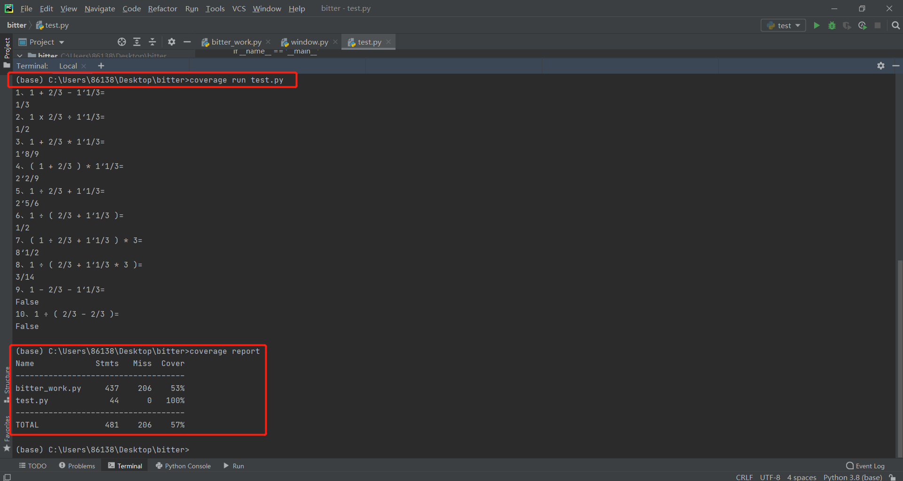

### 7.异常说明

1.文件路径错误

正常的文件路径参数应该是指向存在并且能比较的文件，但如果在输入参数的时候，输错了文件名，则报错FileNotFoundError，这个时候只要重新确认参数就可以了

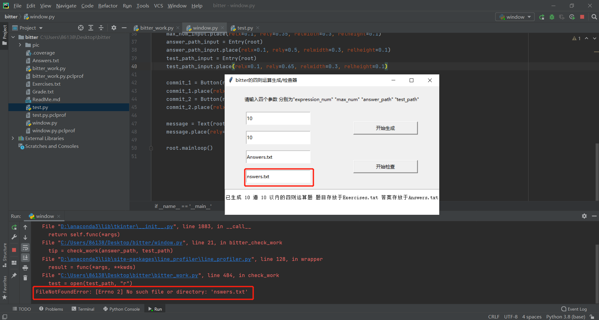

### 8.项目小结

图形界面使用实例展示，如下图

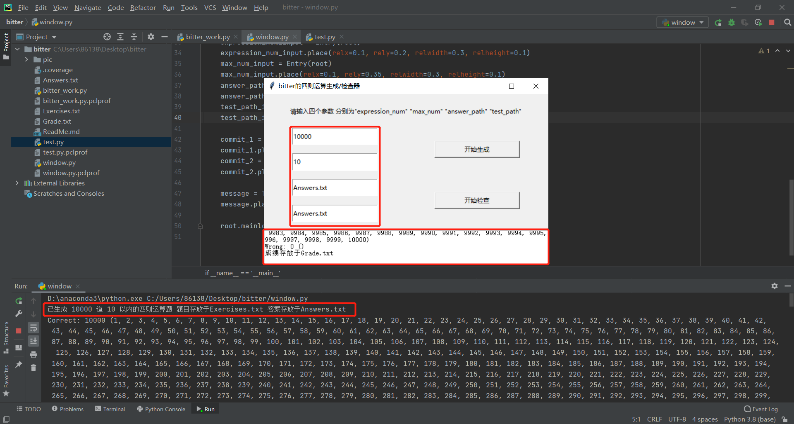

个人感想：

讲道理，这第一次作业难度还是存在一点的，涉及到的具体知识较为广泛，做完这次作业自身的收获还是颇多的，反复修改代码，写bug改bug这个过程也是对自己耐心的一次锻炼，由于我们打算靠原创去编写这个作业，不去借鉴别人的思路，想凭借自己的能力去认真完成这份作业，所以思考和编程花的时间还是算比较多的，最后看到程序做出来了还是感慨万千，付出的努力和时间看到了回报，总结下来的教训就是还是得多思考和多打草稿构建思路。本次结对感受还算不错，队友也是很配合得来，以后有机会可以多交流


